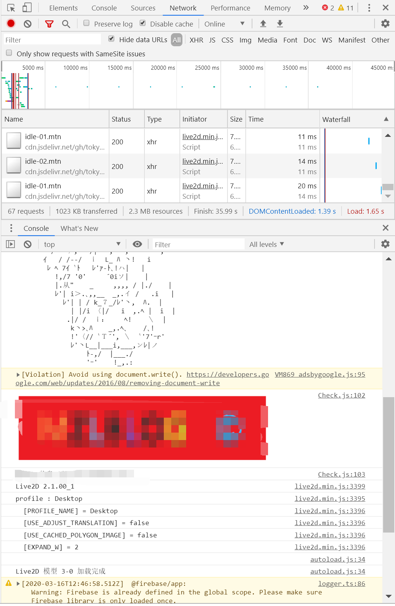

# live2d-cdn

根据 live2d-widget 修改(糟蹋)后用于自己的一个成绩查询项目
原项目地址：[https://github.com/stevenjoezhang/live2d-widget](https://github.com/stevenjoezhang/live2d-widget)

## 简介

对其live2d.min.js (没有找到未加密的版本) 修改了一下，使其可以加载cdn的图标等资源，提高换装/加载效率。

此项目配合修改过的  [live2d-api-cdn](https://github.com/tokyohost/live2d-api-cdn)  可以使用免费的jsdelivr 完成cdn优化，让你的看板娘飞速加载！

注意:本项目与```live2d-api-cdn``` 搭配使用，可完全cdn化，资源全部从免费的CDN中加载。

jsdelivr优化效果，基本秒加载。
(不严谨测试。)   


## 发布版本

首先你需要发布一个自己的版本(也可以使用我的) 

1、fork 此项目，完成api 配置后 发布版本。   
   >api配置请  [live2d-api-cdn](https://github.com/tokyohost/live2d-api-cdn) 

2、测试 jsdelivr 链接。  
   >jsdelivr cdn 用法如下:   
>>标准的访问链接:```https://cdn.jsdelivr.net/gh/你的git用户名/仓库名称@发布的版本号```    
>>如果不加上```@版本号``` 则默认引用最新版本     
>>当然，必须在发布新版本的基础上才能访问。
>    
>**样例CDN资源访问地址**:[https://cdn.jsdelivr.net/gh/tokyohost/live2d_api/model/HyperdimensionNeptunia/blanc_classic/textures.1024/01.png](https://cdn.jsdelivr.net/gh/tokyohost/live2d_api/model/HyperdimensionNeptunia/blanc_classic/textures.1024/01.png)
   
3、完成初步配置


## 使用
在网页中加载看板娘与[原作者的live2d-widget](https://github.com/stevenjoezhang/live2d-widget)一样
>本插件需要 Font Awesome 4.7.0 支持，请确保相关样式表已在页面中加载，例如在 ```<head>``` 中加入：    
 >```<link rel="stylesheet" href="https://cdn.jsdelivr.net/npm/font-awesome/css/font-awesome.min.css">```  
 >否则无法正常显示。（如果网页中已经加载了 Font Awesome，就不要重复加载了）
 >将这一行代码加入 ```<head>``` 或 ```<body>```，即可展现出效果：
 
 >```<script src="https://cdn.jsdelivr.net/gh/你的git账户名/live2d-cdn/autoload.js"></script>```    
>其它注意事项与原版本一样。请移步 [live2d-widget](https://github.com/stevenjoezhang/live2d-widget)
>
 
 修改live2d.min.js 中```path``` 参数，此参数必须设置为你的live2d API 地址： 
 

### **API配置示例**
####1、请先将[live2d-api-cdn]() 配置完成

####2、配置live2d.min.js

我的live2d API 示例地址为：

```https://api.domain.com/live2d_api/get/?id=2-12```

那么你在 ```live2d.min.js``` 中的path参数应为:

```
//CDN替换域名
var replaceHost = "https://api.domain.com/live2d_api/get/+";
//debug 开关
var debug = false;
```
 
其中 ```'+'```号是区分API返回的cdn资源地址和API请求地址的约定符号，如需更改请在API后端也一并进行修改。

### DEBUG

你可以打开Debug 查看live2d.min.js 当前在加载什么链接，其加载情况会打印在consloe中。

```
//debug 开关
var debug = true;
```
正式环境建议关闭，不然console会很难看。。。
##配置live2d API
请移步 [live2d-api-cdn](https://github.com/tokyohost/live2d-api-cdn)  。

